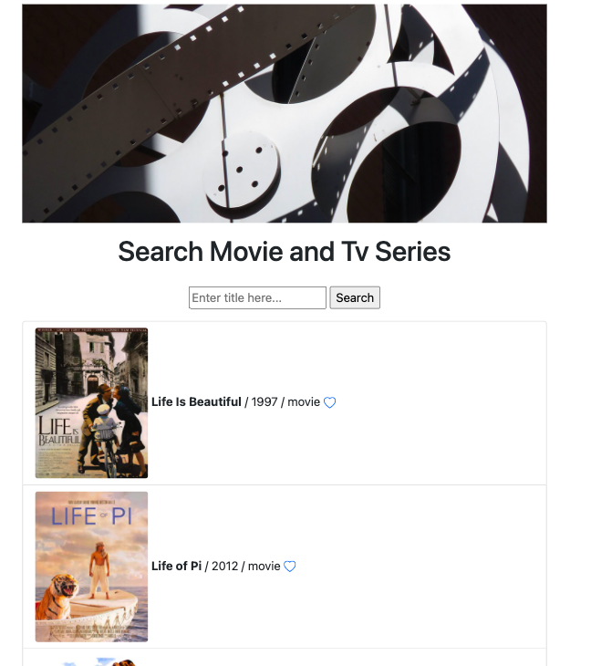
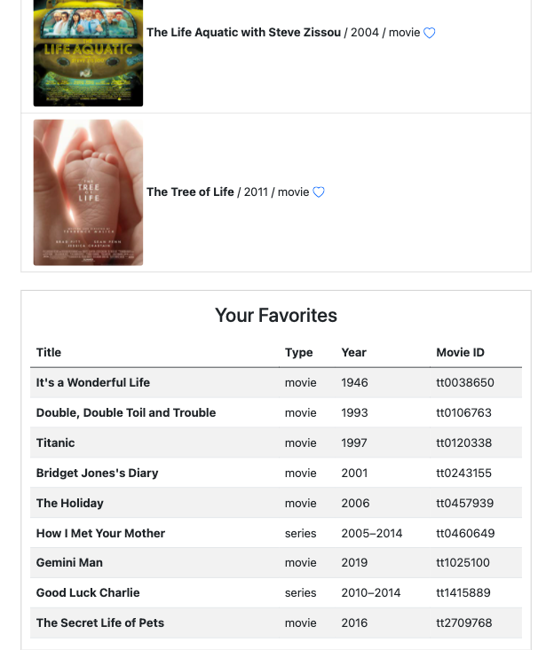

# movieSearchingApp

This is a Restful Api Integration project.
The purpose of this app is basically to search for movies, see a list of results of the related search, and add some, if you'd like, to your favorites table.
You are going to execute this app on your local server environment - MAMP. Install it if it is not available on your computer.
In order for index page to work thoroughly you should require both pdo.php and ImdbApi.php files at the very top of this file.
There is an input field and a submit button to search for movies.
After you "require"d the two necessary files, you basically check if the user has written anything in input field and submitted the word/text that she/he is searching with. If so, you create an instance/object of the MoviesandSeries class, assign it to $imdb variable, and from this instance you call search() method and assign the coming data in $allData variable.
Then, you convert the Json object into a Php associative array and loop through the array as key-value pairs with foreach loop.
Then, you render poster, title, year etc. on the screen as a Bootstrap list group item getting their values in Php e.g. $value['Title']
There is also an SVG heart icon button which records the data of the movie to moviesDb database and favorites table in MySql.
Right after your fav movie insertion into database, you just render it on the index page with SELECT Sql command in another table template. Note that htmlentities() is needed to output data coming from database safely on Html.

So, that's pretty much it. I hope you enjoy making your own movie searching app!

MySQL Commands

1)CREATE DATABASE moviesDb DEFAULT CHARACTER SET utf8;

2)GRANT ALL ON moviesDb.* TO 'root'@'localhost' IDENTIFIED BY 'root';
  GRANT ALL ON moviesDb.* TO 'root'@'127.0.0.1' IDENTIFIED BY 'root';

3)CREATE TABLE favorites (
      movie_id VARCHAR(20) NOT NULL, 
      Title VARCHAR(128), 
      Type VARCHAR(128), 
      Year VARCHAR(128), 
      Poster VARCHAR(255), 
      PRIMARY KEY(movie_id), 
      INDEX(Title)
      );
      
      
......

Files

1) Create Pdo.php file.
  It is required for the fact that you're going to connect to MySQL server, to localhost from within the Php code so that it becomes a secure connection. PDO is       like Php logging into the database.
  MySql port:8889 goes for Mac. Go check and change, if necessary, the MySql port number for Windows (3306 as far as I'm concerned). 
  You can grant privileges to various usernames and passwords at your pleasure on MySql (phpMyAdmin), 
  thus on pdo.php file changing 'username'@'localhost' IDENTIFIED BY 'password'; part of the grant command.
  You will need this file and these MySql commands in order to display a "Your Favorites" table.

2) Create index.php file.
   It's a simple all-in-one-place kind of page. It is styled by Bootstrap.
   You can see that the necesssary Bootstrap link and script tags are placed in the head section to be executed properly throughout your application. 
   It is on the official Bootstrap page coming with their up to date jsDelivr cdn links. At least, that's how I incorporated Bootstrap in this app.

3) Create ImdbApi.php file.
   This is where you write your api-related file.
   You obtain all those movie, tv series etc. data from OMDb API - The Open Movie Database with necessary parameters.
   You need to get an api key.
   You use Php's cURL extension to transfer data from Omdb Api.
   You write cURL code in search() method.
    
   
   

